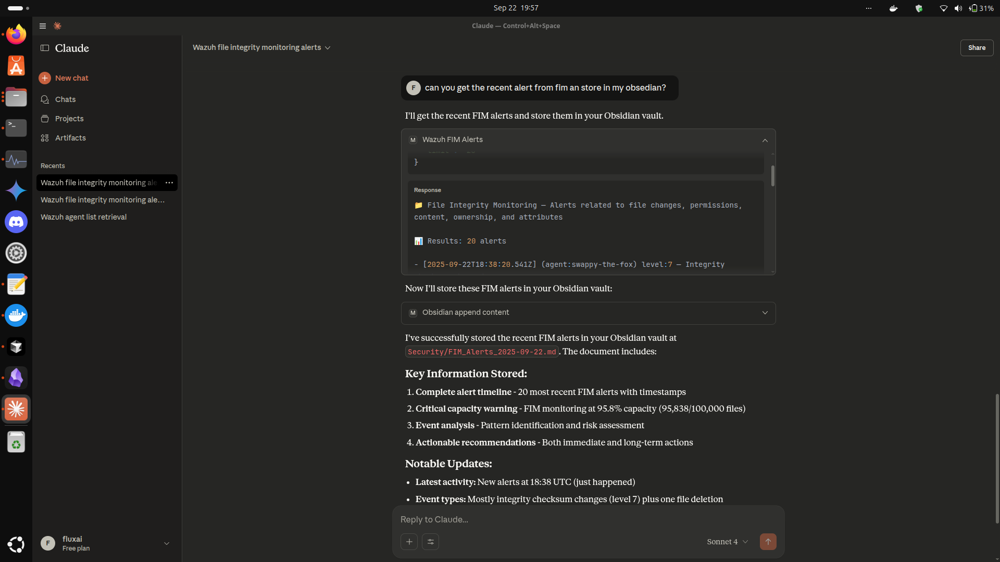
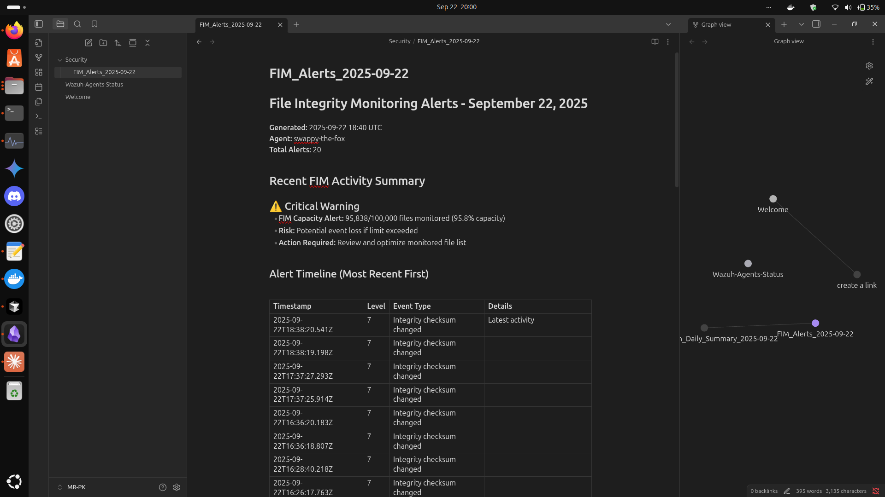

## 🚀 Wazuh MCP Server

A small, focused MCP (Model Context Protocol) server that exposes Wazuh alerts (by category/module) and running agents as tools for LLM frontends (e.g., Claude Desktop). Clean, secure defaults and easy-to-follow integration steps.

### 🧭 Table of Contents

- **What this is**
- **Features**
- **Repository layout**
- **Prerequisites**
- **Environment and secrets**
- **Build and run (local)**
- **Docker MCP secrets (recommended)**
- **Docker MCP + Claude Desktop integration**
- **Testing locally (JSON-RPC over stdio)**
- **Usage examples**
- **Troubleshooting**
- **License**
- **Author**
 - **Screenshots**

### 📦 What this is

This repo contains a single-file MCP server implementation (`wazuh_mcp_server.py`) and the minimal artifacts needed to build and run it inside Docker. The server:

- Obtains a JWT token from the Wazuh API (`/security/user/authenticate?raw=true`) and caches it
- Queries the Wazuh indexer (indices `wazuh-alerts-*`) to retrieve alerts
- Exposes categorized alert tools for Wazuh modules (FIM, Malware, Threat Hunting, Vulnerability, IT Hygiene, PCI, GDPR, HIPAA, AWS, GitHub, Docker, etc.)
- Exposes `get_running_agents` tool (lists agents via Wazuh API)
- Is designed to be launched by an MCP Gateway (Claude Desktop's MCP gateway) and accept secrets via Docker MCP secrets or environment variables

### ✨ Features

- **Auth**: JWT-based Wazuh server authentication with token caching
- **Search**: Indexer (Elasticsearch/OpenSearch) helper for `wazuh-alerts-*`
- **Tools**: One tool per Wazuh module (e.g., `wazuh_FIM_Alerts`, `wazuh_Malware_Alerts`)
- **Agents**: `get_running_agents` for quick visibility
- **UX**: Human-readable, emoji-enhanced outputs (❌ errors, ✅/📊 success)
- **Security**: Runs as non-root in Docker; self-signed certs allowed for internal networks

### 📁 Repository layout

```text
wazuh-mcp-server/
├─ Dockerfile
├─ requirements.txt
├─ wazuh_mcp_server.py      # MCP server (main implementation)
├─ readme.txt               # Legacy readme (optional)
├─ CLAUDE.md                # Implementation notes
└─ README.md                # This file
```

### 🧰 Prerequisites

- **Docker Desktop** (with MCP Toolkit support if integrating with Claude Desktop)
- **docker** CLI
- **docker mcp** CLI plugin (for Docker MCP secrets and catalogs)
- **Network access** to Wazuh API (port 55000) and Wazuh indexer (port 9200)
- **Python 3.11** (optional, for local testing)

### 🔐 Environment and secrets

Local `.env` example (for development only):

```dotenv
# .env (example)
WAZUH_API_USER=wazuh
WAZUH_API_PASS=api-pass
WAZUH_API_URLS=https://192.168.x.x:55000,https://127.0.0.1:55000
INDEXER_USER=admin
INDEXER_PASS=indexer-pass
INDEXER_URLS=https://192.168.x.x:9200,https://127.0.0.1:9200
```

Prefer using Docker MCP secrets for production and Claude integration.

### 🛠️ Build and run (local)

Build the Docker image (from repo root):

```bash
docker build -t wazuh_mcp-server .
```

Quick local run (debug; env vars injected — for manual testing only):

```bash
# export or set the envs first (example)
export WAZUH_API_USER="wazuh"
export WAZUH_API_PASS="api-pass"
export WAZUH_API_URLS="https://192.168.x.x:55000,https://127.0.0.1:55000"
export INDEXER_USER="admin"
export INDEXER_PASS="indexer-pass"
export INDEXER_URLS="https://192.168.x.x:9200,https://127.0.0.1:9200"

docker run --rm -i \
  -e WAZUH_API_USER="$WAZUH_API_USER" \
  -e WAZUH_API_PASS="$WAZUH_API_PASS" \
  -e WAZUH_API_URLS="$WAZUH_API_URLS" \
  -e INDEXER_USER="$INDEXER_USER" \
  -e INDEXER_PASS="$INDEXER_PASS" \
  -e INDEXER_URLS="$INDEXER_URLS" \
  wazuh_mcp-server
```

Note: This is to validate the server process and logs. For normal use with Claude, run via the MCP Gateway.

### 🧳 Docker MCP secrets (recommended)

Store secrets so Claude's MCP gateway injects them into the server container:

```bash
docker mcp secret set WAZUH_API_USER="wazuh"
docker mcp secret set WAZUH_API_PASS="api-pass"
docker mcp secret set INDEXER_USER="admin"
docker mcp secret set INDEXER_PASS="indexer-pass"
docker mcp secret set WAZUH_API_URLS="https://192.168.x.x:55000,https://127.0.0.1:55000"
docker mcp secret set INDEXER_URLS="https://192.168.x.x:9200,https://127.0.0.1:9200"

docker mcp secret list
```

### 🖥️ Docker MCP + Claude Desktop integration

Build the image locally:

```bash
docker build -t wazuh_mcp-server .
```

Ensure your `custom.yaml` (catalog) contains the `wazuh_mcp` entry and maps secret names to environment variables. Important fields:

- **image**: `wazuh_mcp-server:latest`
- **tools**: list of tool names (e.g., `get_running_agents`, `wazuh_FIM_Alerts`, ...)
- **secrets**: mapping secret names to env variables used by the container

Edit Claude Desktop config to run the MCP Gateway with your custom catalog. Example snippet (Linux):

```json
{
  "mcpServers": {
    "mcp-toolkit-gateway": {
      "command": "docker",
      "args": [
        "run",
        "-i",
        "--rm",
        "-v", "/var/run/docker.sock:/var/run/docker.sock",
        "-v", "/home/your_username/.docker/mcp:/mcp",
        "docker/mcp-gateway",
        "--catalog=/mcp/catalogs/docker-mcp.yaml",
        "--catalog=/mcp/catalogs/custom.yaml",
        "--config=/mcp/config.yaml",
        "--registry=/mcp/registry.yaml",
        "--tools-config=/mcp/tools.yaml",
        "--transport=stdio"
      ]
    }
  }
}
```

Start/restart Claude Desktop (or restart the gateway). The gateway will:

- Read `custom.yaml`
- Launch container `wazuh_mcp-server:latest` for `wazuh_mcp`
- Inject secrets using Docker MCP secret store
- Discover and expose tools in Claude

### 🧪 Testing locally (JSON-RPC over stdio)

If you want to test the MCP protocol directly with the Python file (no gateway), run the server manually (stdin/stdout mode):

```bash
# Start server (blocks stdin)
python wazuh_mcp_server.py
```

### 💬 Usage examples (ask Claude)

- "List running Wazuh agents (show at most 10)."
- "Show latest File Integrity Monitoring alerts."
- "Show 20 Malware Detection alerts filtered by agent agent-123."
- "Give me MITRE ATT&CK mapped alerts from the last 50 entries."

Each tool accepts parameters (where supported), such as:

- **limit** (string) — e.g., `"10"`, `"20"`
- **agent** (string) — optional agent name/id filter

Example internal tool names (discovered by the gateway):

```text
get_running_agents
wazuh_FIM_Alerts
wazuh_Malware_Alerts
wazuh_Threat_Hunting_Alerts
wazuh_Vulnerability_Alerts
# ... and the rest listed in custom.yaml
```

### 🆘 Troubleshooting

#### ❗ Cannot reach indexer (connection refused)

```bash
curl -k -u "admin:INDEXER_PASS" "https://192.168.x.x:9200/_cluster/health"
# curl: (7) Failed to connect
```

- Ensure Wazuh indexer service is running on the manager host:

```bash
sudo systemctl status wazuh-indexer
sudo systemctl start wazuh-indexer
```

- Ensure firewall allows port 9200 from the gateway host
- If using Docker on the same host, consider `host.docker.internal` or a reachable host IP

#### 🔑 Authentication errors from Wazuh API

```bash
curl -k -u "wazuh:WAZUH_API_PASS" -X POST "https://192.168.x.x:55000/security/user/authenticate?raw=true"
```

- Should return a token string
- If authentication fails, verify Wazuh API user/pass in secrets or `.env`

#### 🧰 Tools not showing in Claude

- Confirm `~/.docker/mcp/catalogs/custom.yaml` exists and includes `wazuh_mcp`
- Confirm `registry.yaml` has `wazuh_mcp` under the `registry:` key
- Confirm Claude Desktop config includes `--catalog=/mcp/catalogs/custom.yaml`
- Restart Claude Desktop

### 📸 Screenshots

Claude Desktop showing recent Wazuh FIM alerts retrieved via the MCP server:




Obsidian vault note generated from the same FIM alerts (stored via tools):




### 📄 License

MIT — include a `LICENSE` file in the repo if publishing publicly.

### 👤 Author / Environment

- **Author**: Mr PK
- **Environment used**: Ubuntu 24.04, Wazuh 4.13 (latest at time of writing), Docker Desktop with MCP Toolkit enabled, Claude Desktop rebuilt for Debian-based systems
- Thanks to NetworkChuck for inspiration getting started 🙌