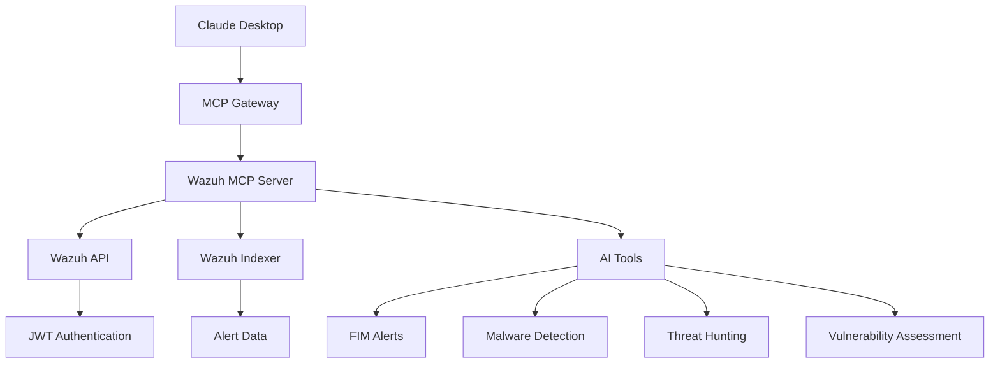

<div align="center">


# 🛡️ Wazuh MCP Server

**A powerful Model Context Protocol (MCP) server that bridges Wazuh SIEM with AI assistants like Claude Desktop**

[](https://opensource.org/licenses/MIT)
[](https://www.docker.com/)
[](https://python.org/)
[](https://wazuh.com/)

*Transform your security monitoring with AI-powered insights*

</div>

---

## 📋 Table of Contents

- [🎯 What is this?](#-what-is-this)
- [✨ Features](#-features)
- [🏗️ Architecture](#️-architecture)
- [📁 Repository Structure](#-repository-structure)
- [🚀 Quick Start](#-quick-start)
- [🔧 Prerequisites](#-prerequisites)
- [🔐 Configuration](#-configuration)
- [🐳 Docker Setup](#-docker-setup)
- [🤖 Claude Desktop Integration](#-claude-desktop-integration)
- [🧪 Testing](#-testing)
- [💡 Usage Examples](#-usage-examples)
- [🆘 Troubleshooting](#-troubleshooting)
- [📸 Screenshots](#-screenshots)
- [📄 License](#-license)
- [👨‍💻 Author](#-author)

---

## 🎯 What is this?

The **Wazuh MCP Server** is a specialized Model Context Protocol server that seamlessly integrates Wazuh SIEM capabilities with AI assistants. It provides real-time access to security alerts, agent status, and threat intelligence through a clean, standardized interface.

### 🎪 Key Capabilities

- **🔍 Real-time Alert Monitoring** - Access alerts from all Wazuh modules
- **🤖 AI-Native Integration** - Designed specifically for Claude Desktop and other MCP clients
- **🔐 Secure Authentication** - JWT-based token management with automatic refresh
- **📊 Multi-Module Support** - FIM, Malware Detection, Threat Hunting, Vulnerability Assessment, and more
- **🐳 Container-Ready** - Fully containerized with Docker support
- **⚡ High Performance** - Optimized for real-time security operations

---

## ✨ Features

### 🔐 Security & Authentication
- **JWT Token Management** - Automatic authentication with Wazuh API
- **Token Caching** - Efficient token reuse to minimize API calls
- **Secure Secrets** - Docker MCP secrets integration for production deployments

### 📊 Monitoring & Alerts
- **File Integrity Monitoring (FIM)** - Track file changes and modifications
- **Malware Detection** - Identify potential threats and suspicious activities
- **Threat Hunting** - Advanced threat detection and analysis
- **Vulnerability Assessment** - Security vulnerability tracking
- **IT Hygiene** - System configuration and compliance monitoring
- **Docker Monitoring** - Container security and activity tracking
- **MITRE ATT&CK Mapping** - Tactics, techniques, and procedures analysis

### 🛠️ Technical Features
- **Multi-Indexer Support** - Elasticsearch and OpenSearch compatibility
- **Smart Fallbacks** - Manager logs when indexer is unavailable
- **Error Handling** - Comprehensive error management and reporting
- **Emoji-Enhanced Output** - Human-readable, visually appealing responses
- **Non-Root Execution** - Secure container operation

---

## 🏗️ Architecture



---

## 📁 Repository Structure

```
wazuh-mcp-server/
├── 🐳 Dockerfile                 # Container configuration
├── 📦 requirements.txt           # Python dependencies
├── 🐍 wazuh_mcp_server.py       # Main MCP server implementation
├── 📋 setup.sh                   # Setup and configuration script
├── 📖 README.md                  # This documentation
├── 📝 CHANGELOG.md               # Version history
├── 📄 LICENSE                    # MIT License
├── 🔧 custom.yaml                # MCP catalog configuration
├── 📁 assets/                    # Screenshots and images
│   ├── claude-fim-alerts.png
│   └── obsidian-fim-alerts.png
└── 📚 docs/                      # Additional documentation
```

---

## 🚀 Quick Start

### 1️⃣ Clone the Repository

```bash
git clone https://github.com/your-username/wazuh-mcp-server.git
cd wazuh-mcp-server
```

### 2️⃣ Build the Docker Image

```bash
docker build -t wazuh-mcp-server .
```

### 3️⃣ Configure Secrets

```bash
# Set up Docker MCP secrets
docker mcp secret set WAZUH_API_USER="wazuh"
docker mcp secret set WAZUH_API_PASS="your-api-password"
docker mcp secret set INDEXER_USER="admin"
docker mcp secret set INDEXER_PASS="your-indexer-password"
docker mcp secret set WAZUH_API_URLS="https://your-wazuh-manager:55000"
docker mcp secret set INDEXER_URLS="https://your-indexer:9200"
```

### 4️⃣ Test the Connection

```bash
# Test imports and connectivity
docker run --network host --rm \
  -e WAZUH_PASSWORD="your-password" \
  -e WAZUH_INDEXER_USERNAME="admin" \
  -e WAZUH_INDEXER_PASSWORD="your-indexer-password" \
  wazuh-mcp-server python3 -c "
import sys
sys.path.append('.')
from wazuh_mcp_server import search_wazuh_alerts_index, WAZUH_MODULES
print('✅ All imports successful')
print(f'Configured modules: {len(WAZUH_MODULES)}')
"
```

---

## 🔧 Prerequisites

### System Requirements
- **🐳 Docker Desktop** (with MCP Toolkit support)
- **🐍 Python 3.11+** (for local development)
- **🌐 Network Access** to Wazuh Manager (port 55000) and Indexer (port 9200)

### Wazuh Requirements
- **Wazuh Manager** 4.13+ with API enabled
- **Wazuh Indexer** (Elasticsearch/OpenSearch) running
- **Valid API credentials** with appropriate permissions

---

## 🔐 Configuration

### Environment Variables

Create a `.env` file for local development:

```dotenv
# Wazuh API Configuration
WAZUH_API_USER=wazuh
WAZUH_API_PASS=your-api-password
WAZUH_API_URLS=https://192.168.1.100:55000,https://127.0.0.1:55000

# Indexer Configuration
INDEXER_USER=admin
INDEXER_PASS=your-indexer-password
INDEXER_URLS=https://192.168.1.100:9200,https://127.0.0.1:9200
```

### Docker MCP Secrets (Recommended)

For production deployments, use Docker MCP secrets:

```bash
# Set all required secrets
docker mcp secret set WAZUH_API_USER="wazuh"
docker mcp secret set WAZUH_API_PASS="your-secure-password"
docker mcp secret set INDEXER_USER="admin"
docker mcp secret set INDEXER_PASS="your-indexer-password"
docker mcp secret set WAZUH_API_URLS="https://your-wazuh:55000"
docker mcp secret set INDEXER_URLS="https://your-indexer:9200"

# Verify secrets are set
docker mcp secret list
```

---

## 🐳 Docker Setup

### Build the Image

```bash
# Build the Docker image
docker build -t wazuh-mcp-server .

# Tag for registry (optional)
docker tag wazuh-mcp-server:latest your-registry/wazuh-mcp-server:latest
```

### Run Locally

```bash
# Quick test run
docker run --rm -i \
  -e WAZUH_API_USER="wazuh" \
  -e WAZUH_API_PASS="your-password" \
  -e WAZUH_API_URLS="https://192.168.1.100:55000" \
  -e INDEXER_USER="admin" \
  -e INDEXER_PASS="your-indexer-password" \
  -e INDEXER_URLS="https://192.168.1.100:9200" \
  wazuh-mcp-server
```

---

## 🤖 Claude Desktop Integration

### 1️⃣ Configure MCP Catalog

Create `~/.docker/mcp/catalogs/custom.yaml`:

```yaml
version: 2
name: custom
displayName: Custom MCP Servers
registry:
  wazuh_mcp:
    description: "Security monitoring and alert management via Wazuh SIEM platform"
    title: "Wazuh Security Monitor"
    type: server
    dateAdded: "2025-09-23T00:00:00Z"
    image: wazuh-mcp-server:latest
    ref: ""
    tools:
      - name: get_wazuh_agents
      - name: get_wazuh_running_agents
      - name: test_wazuh_indexer_connection
      - name: get_file_integrity_monitoring_alerts
      - name: get_malware_detection_alerts
      - name: get_threat_hunting_alerts
      - name: get_vulnerability_detection_alerts
      - name: get_it_hygiene_alerts
      - name: get_docker_alerts
      - name: get_mitre_attack_alerts
    secrets:
      - name: WAZUH_API_USER
        env: WAZUH_API_USER
        example: "wazuh"
      - name: WAZUH_API_PASS
        env: WAZUH_API_PASS
        example: "your-password"
      - name: INDEXER_USER
        env: INDEXER_USER
        example: "admin"
      - name: INDEXER_PASS
        env: INDEXER_PASS
        example: "your-indexer-password"
      - name: WAZUH_API_URLS
        env: WAZUH_API_URLS
        example: "https://192.168.1.100:55000"
      - name: INDEXER_URLS
        env: INDEXER_URLS
        example: "https://192.168.1.100:9200"
    metadata:
      category: security
      license: MIT
      owner: local
```

### 2️⃣ Update Registry

Create `~/.docker/mcp/registry.yaml`:

```yaml
registry:
  wazuh_mcp:
    ref: ""
```

### 3️⃣ Configure Claude Desktop

Update your Claude Desktop configuration (`~/.config/Claude/claude_desktop_config.json`):

```json
{
  "mcpServers": {
    "mcp-toolkit-gateway": {
      "command": "docker",
      "args": [
        "run",
        "-i",
        "--rm",
        "-v", "/var/run/docker.sock:/var/run/docker.sock",
        "-v", "/home/your_username/.docker/mcp:/mcp",
        "docker/mcp-gateway",
        "--catalog=/mcp/catalogs/docker-mcp.yaml",
        "--catalog=/mcp/catalogs/custom.yaml",
        "--config=/mcp/config.yaml",
        "--registry=/mcp/registry.yaml",
        "--tools-config=/mcp/tools.yaml",
        "--transport=stdio"
      ]
    }
  }
}
```

### 4️⃣ Restart Claude Desktop

Restart Claude Desktop to load the new MCP server configuration.

---

## 🧪 Testing

### Test Server Functionality

```bash
# Test basic connectivity
docker run --network host --rm \
  -e WAZUH_PASSWORD="your-password" \
  -e WAZUH_INDEXER_USERNAME="admin" \
  -e WAZUH_INDEXER_PASSWORD="your-indexer-password" \
  wazuh-mcp-server python3 -c "
import asyncio
import sys
sys.path.append('.')
from wazuh_mcp_server import search_wazuh_alerts_index

async def test():
    data, error = await search_wazuh_alerts_index({'query': {'match_all': {}}, 'size': 3})
    if error:
        print(f'❌ Indexer Error: {error}')
    else:
        hits = data.get('hits', {}).get('hits', [])
        total = data.get('hits', {}).get('total', 0)
        if isinstance(total, dict):
            total = total.get('value', 0)
        print(f'✅ Found {len(hits)} alerts out of {total} total!')
        for hit in hits:
            rule = hit.get('_source', {}).get('rule', {})
            agent = hit.get('_source', {}).get('agent', {})
            print(f'  - Rule {rule.get(\"id\")}: {rule.get(\"description\", \"No description\")[:60]}... (Agent: {agent.get(\"name\", \"Unknown\")})')

asyncio.run(test())
"
```

### Test MCP Protocol

```bash
# Test MCP server directly
python wazuh_mcp_server.py
```

---

## 💡 Usage Examples

Once integrated with Claude Desktop, you can ask questions like:

### 🔍 Agent Management
- *"Show me all running Wazuh agents"*
- *"List agents with their last check-in times"*
- *"Which agents are offline?"*

### 🚨 Alert Analysis
- *"Show me the latest File Integrity Monitoring alerts"*
- *"Display malware detection alerts from the last 24 hours"*
- *"Find high-severity threat hunting alerts"*
- *"Show vulnerability detection alerts for agent-123"*

### 📊 Security Insights
- *"Give me a summary of all security events today"*
- *"Show MITRE ATT&CK mapped alerts"*
- *"What are the most common rule violations?"*
- *"Analyze Docker container security events"*

### 🛠️ Troubleshooting
- *"Test the Wazuh indexer connection"*
- *"Check if the Wazuh API is responding"*
- *"Show me any authentication errors"*

---

## 🆘 Troubleshooting

### ❌ Common Issues

#### 🔌 Connection Refused (Indexer)

```bash
# Test indexer connectivity
curl -k -u "admin:your-password" "https://your-indexer:9200/_cluster/health"
```

**Solutions:**
- Ensure Wazuh indexer is running: `sudo systemctl status wazuh-indexer`
- Check firewall settings for port 9200
- Verify network connectivity between containers

#### 🔑 Authentication Errors

```bash
# Test Wazuh API authentication
curl -k -u "wazuh:your-password" -X POST "https://your-wazuh:55000/security/user/authenticate?raw=true"
```

**Solutions:**
- Verify API credentials in secrets
- Check Wazuh API user permissions
- Ensure API is enabled on Wazuh manager

#### 🧰 Tools Not Appearing in Claude

**Checklist:**
- ✅ `custom.yaml` exists at `~/.docker/mcp/catalogs/custom.yaml`
- ✅ `registry.yaml` includes `wazuh_mcp` entry
- ✅ Claude Desktop config points to custom catalog
- ✅ Docker image built successfully
- ✅ Claude Desktop restarted after configuration

### 🔧 Debug Commands

```bash
# Check MCP server list
docker mcp server list

# Verify secrets
docker mcp secret list

# Test Docker image
docker run --rm wazuh-mcp-server python3 -c "print('✅ Image working')"

# Check file permissions
ls -la ~/.docker/mcp/catalogs/
```

---

## 📸 Screenshots

### Claude Desktop Integration

Claude Desktop showing recent Wazuh FIM alerts retrieved via the MCP server:


### Obsidian Integration

Obsidian vault note generated from the same FIM alerts (stored via tools):


---

## 📄 License

This project is licensed under the MIT License - see the [LICENSE](LICENSE) file for details.

---

## 👨‍💻 Author

**Mr PK** - *Security Engineer & Developer*

- **Environment**: Ubuntu 24.04, Wazuh 4.13, Docker Desktop with MCP Toolkit
- **Special Thanks**: NetworkChuck for the inspiration and guidance 🙌

---

<div align="center">

**⭐ Star this repository if you find it helpful!**

*Built with ❤️ for the security community*

</div>